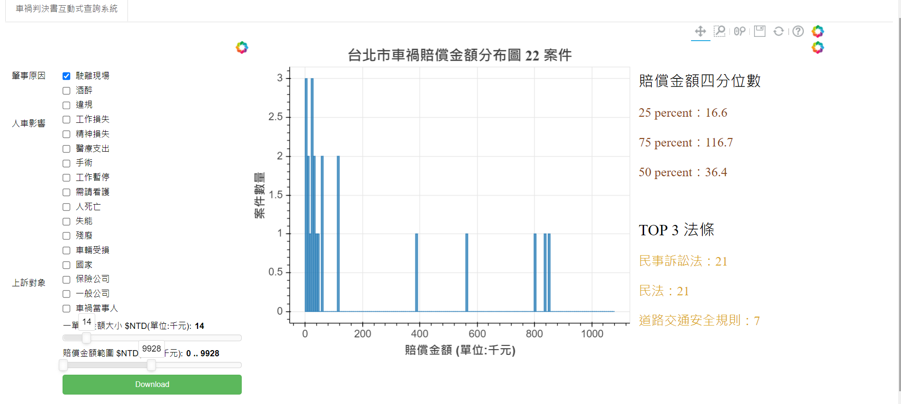

# Car-Accident-Dashboard-2019
Project for the Law Tech Hackathon

## Introduction
[The Websiteon Heroku](https://caraccidentapp.herokuapp.com/bokeh_app)  

The Website Screen Shot  

* Left Panel : condition chekboxes/ range sliders/ bin width sliders.  

* Middle Panel :   

    Histogram of compensation value under checked conditions.  It will display individual value when your mouse hover to the bin.
                 
* Right Panel :  
  1. The Inter Quantile Range of compensation values under checked conditions.   
  2. Top 3 mentioned laws under checked conditions.
  
## Structure

* Directory
  1. record : analyze procedure and types of cases belong or not belong to car accident
  2. presentation : demo videos and present pdf.
  3. keywords : candidate conditions for car accident. (Generate by Decision Tree model or induction).
  4. bokeh_app : the folder uploaded on Heroku.
  
* File
  1. 3 .ipynb files : Preprocess data / Generate keywords (To find proper conditions) / Add condition columns.
  2. histogram.py : All interactive visualization part (Use bokeh package)
  3. download.js : Download the cases conform to selected conditions when clicking the 下載 Button

## Notice
This is a project I wrote on my own in 2019.
This is the first time I wrote a website and deployed a project to a server.

